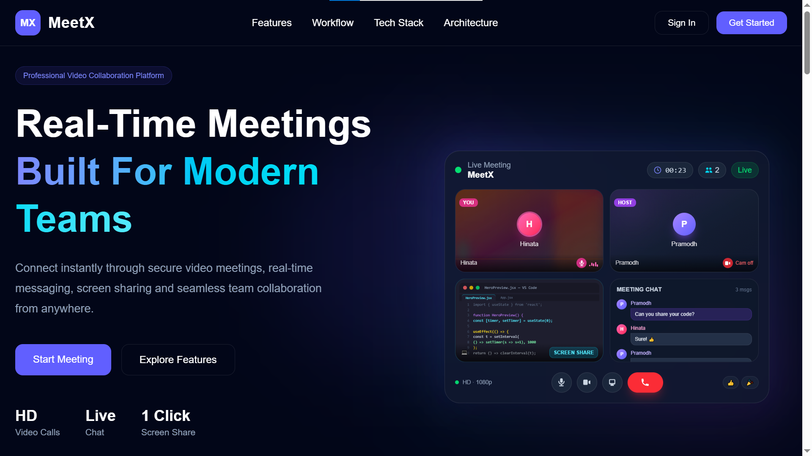
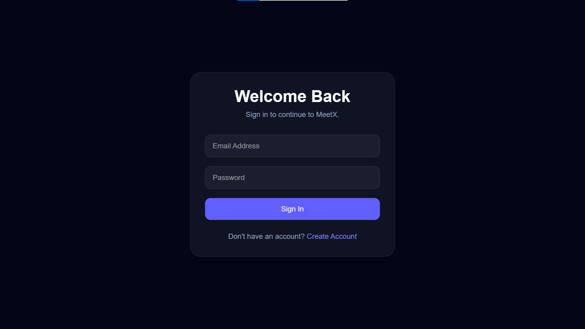
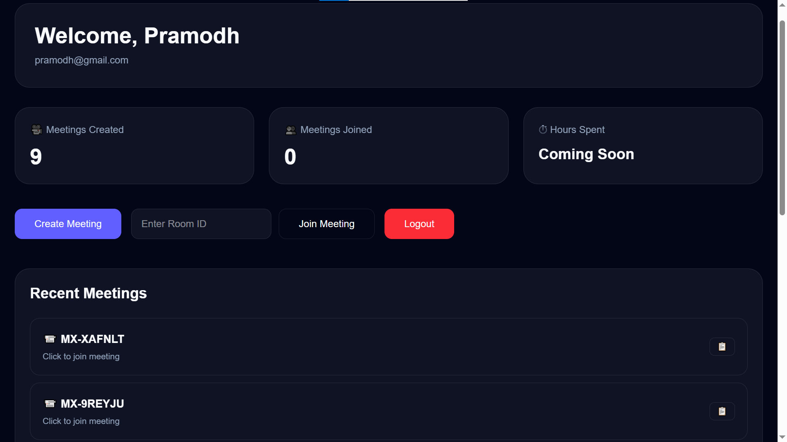
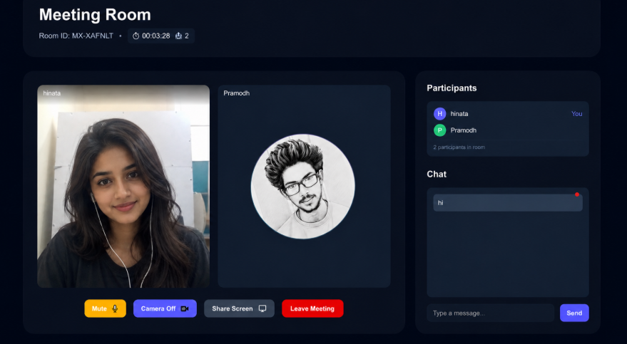
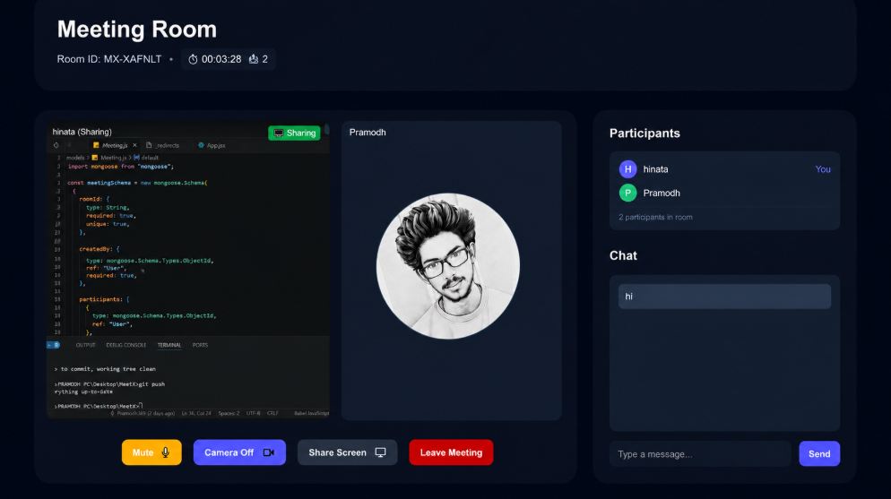
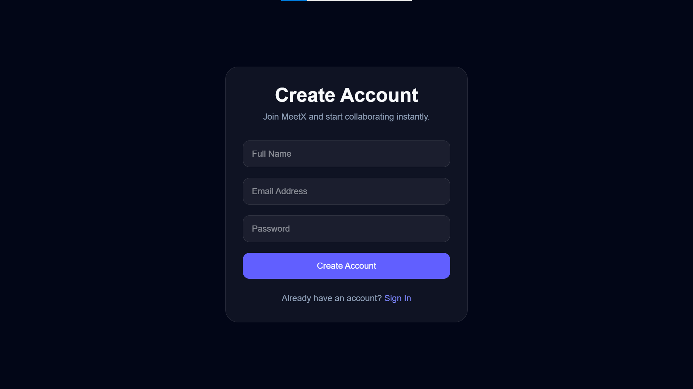

# MeetX

MeetX is a full-stack video collaboration platform built with the MERN stack. It allows users to securely create and join meeting rooms with real-time video communication, live chat, participant management, and a responsive user interface.

The project was built to strengthen my full-stack development skills by working with authentication, WebRTC, Socket.IO, REST APIs, and cloud deployment.

## Live Demo

**Frontend:** https://meetx3.netlify.app

**Backend:** https://meetx-zor0.onrender.com

## Demo Account

Email: **test@gmail.com**

Password: **123456**

> **Note:** Video calling uses WebRTC. Depending on the network environment, some peer-to-peer connections may require a TURN server for reliable connectivity.

---

## Project Highlights

- JWT-based user authentication
- Protected dashboard
- Create and join meeting rooms
- Real-time chat using Socket.IO
- WebRTC video communication
- Screen sharing
- Camera and microphone controls
- Meeting timer
- Responsive design
- MongoDB integration
- GitHub Actions CI
- Netlify + Render deployment

---

## Tech Stack

### Frontend

- React
- React Router
- Tailwind CSS
- Axios
- Socket.IO Client
- Simple Peer (WebRTC)
- GSAP
- AOS

### Backend

- Node.js
- Express.js
- MongoDB
- Mongoose
- JWT Authentication
- Socket.IO

---

## 📸 Application Preview

| Landing Page | Authentication |
|---|---|
|  |  |

| Dashboard | Meeting Room |
|---|---|
|  |  |

| Screen Sharing | Registration |
|---|---|
|  |  |

---

## Getting Started

Clone the repository

```bash
git clone https://github.com/Pramodh369/MeetX.git
```

Install client dependencies

```bash
cd client
npm install
npm run dev
```

Install server dependencies

```bash
cd server
npm install
npm start
```

---

## Environment Variables

### Client

```env
VITE_API_URL=
VITE_SOCKET_URL=
```

### Server

```env
PORT=
MONGO_URI=
JWT_SECRET=
```

---

## Continuous Integration

GitHub Actions automatically builds the client and server whenever changes are pushed to the repository, helping ensure the project remains buildable.

---

## Future Improvements

- TURN server support
- Multi-participant meetings
- Meeting recording
- File sharing
- AI meeting summaries
- Meeting scheduling

---

## License

This project is licensed under the **MIT License**.